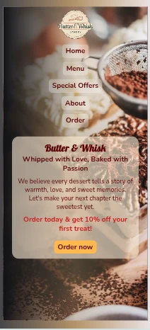

# Butter & Whisk - Bakery Landing Page

A responsive landing page for **Butter & Whisk**, a fictional bakery shop.  
This project is my first attempt at designing and developing a web page from scratch using **HTML** and **CSS**.

---

## Preview

**Desktop view:**

**Mobile view:**

[Live Demo](https://amira713.github.io/bakery-project/)

---

## Features
- Responsive design for desktop, tablet, and mobile.
- Eye-catching hero section with a promotional offer.
- Navigation bar with hover effects.
- Call-to-action button to encourage orders.
- Modern typography using Google Fonts.
- Background image with gradient overlay.

---

## Technologies Used
- HTML5
- CSS3 (Flexbox, Media Queries)
- Google Fonts

---

